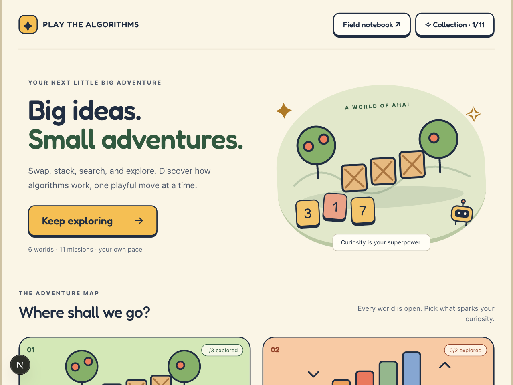
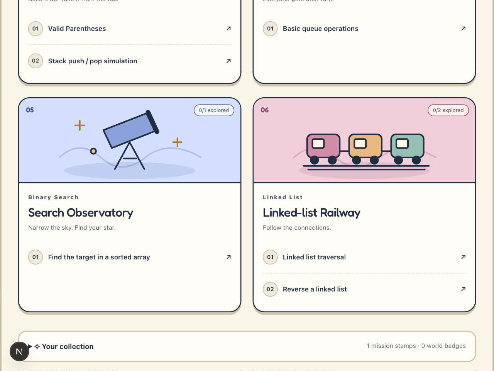
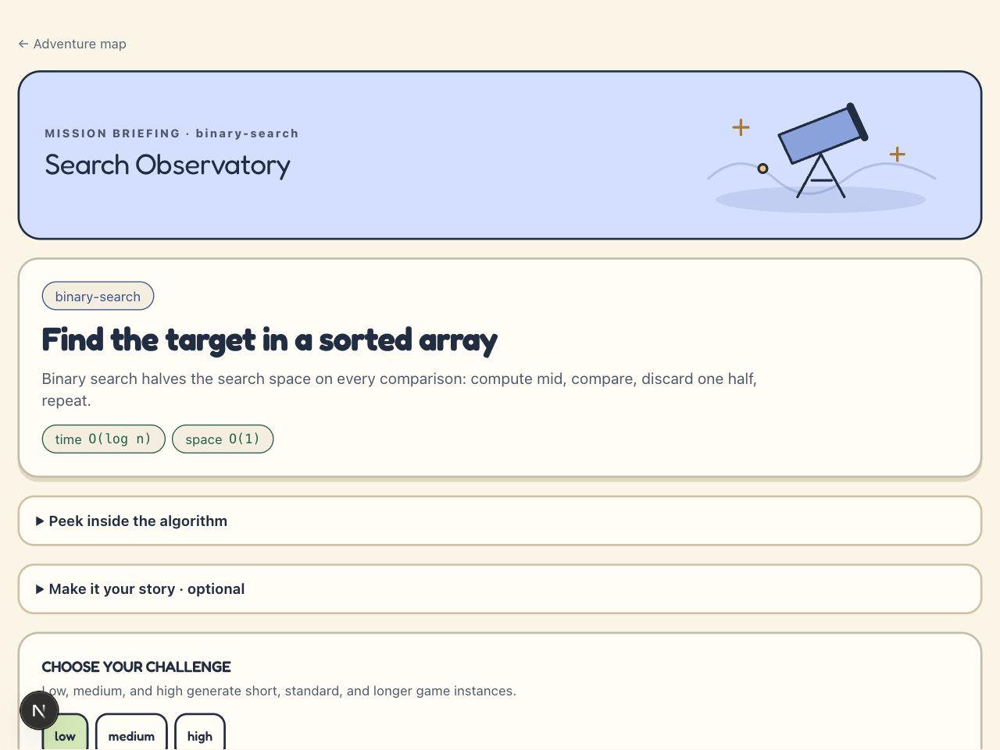
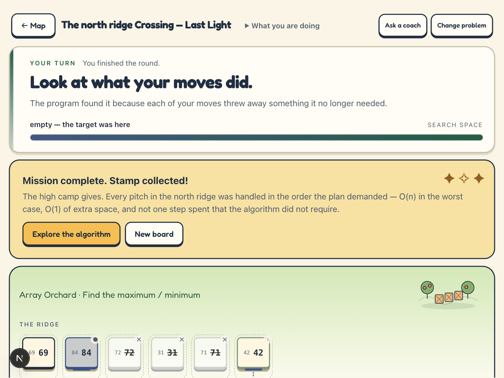
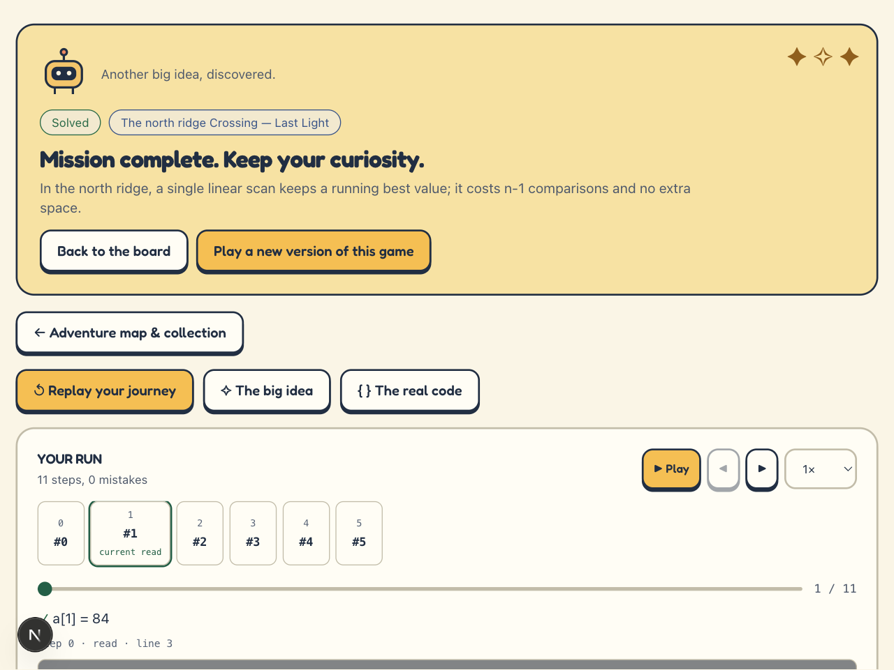
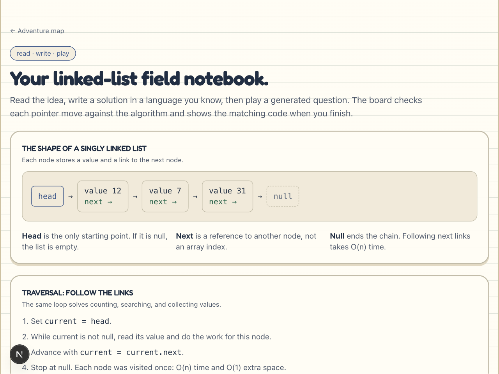

# DSA Game

Learn DSA algorithms by **playing generated mini-games** instead of solving coding problems.

An LLM writes the *theme*; a deterministic engine owns the *truth*. The player
makes moves that are literally algorithm operations, and afterwards sees their
own moves replayed against the real algorithm and its code.

---

## The one idea that makes this work

There are three sources of truth, strictly separated:

| Concern | Owner | Never consulted for |
|---|---|---|
| **Truth** — is this move correct, is the game won, the canonical trace, the code | hand-written deterministic **oracle** (`packages/dsa-oracles`) | anything generative |
| **Presentation** — theme, story, labels, narration | **generative LLM** (`packages/provider-chain`) | correctness, answers, code |
| **Fast local micro-decisions** — routing, hint choice, difficulty, misconception tagging | **Laya** (`packages/decision-layer`) | anything generative |

Consequences:

- The LLM can only fill **text slots** and pick from a **fixed mechanics enum**
  (`selectObject`, `moveObject`, `comparePair`, `swapPair`, `pushPop`,
  `choosePath`, `traverseNode`, `connectNodes`, `assignValue`, `submitAnswer`).
  `GameSpecSchema` is `strict()`, so an over-eager `correct: true` is rejected.
- **The app cannot break.** If every LLM tier is down, a deterministic
  `template` tier still produces a fully playable game.
- **Both clients share one implementation of correctness.** The algorithm logic
  lives in the API service; the Next.js app and the Flutter app are
  presentation-only clients.

> **On Laya:** it is *not* a text generator. It is a non-autoregressive
> decision engine that answers `choice` / `score` / `noul` in one forward pass.
> It is therefore never used to author games — only to make fast local
> classification decisions. See `services/laya/README.md`.
>
> **On required vs allowed:** `allowedMechanics` is what a generator *may* use;
> `requiredMechanics` are the load-bearing ones it may not drop. A theme with
> no `choosePath` is not binary search any more, it is a guessing game.
>
> **On wording:** the oracle's labels contain notation (`index 6`, `mid = 3`) and
> are precise; the guidance module in `packages/game-engine` owns every
> learner-facing string. Precision in one place, plain English in the other.
>
> **On the coach:** `/api/coach/ask` answers questions about the game but is
> validated to never reveal the answer — enforced as a check over the generated
> text (`services/api/src/coach/guardrails.ts`), not as a prompt instruction. A
> prompt rule is a suggestion; a validator is a guarantee.
>
> **On the hint ladder:** the same principle now applies to `/api/hint`, which
> had no validator at all and shipped the algorithm. See "What a hint is not
> allowed to be" below.

---

## Layout

```
packages/
  game-schema/     Zod schemas, Action union, mechanics catalog, Oracle interface, wire types
  game-engine/     deterministic runtime: apply/undo/hints/telemetry
  dsa-oracles/     one deterministic reference algorithm per DSA problem
  provider-chain/  5 generation tiers: opencode-go -> opencode -> openrouter -> local qwen -> template
  decision-layer/  Laya client + deterministic heuristics
services/
  api/             Hono HTTP API (the only thing the clients talk to)
  laya/            python venv + laya-serve sidecar
  local-llm/       llama.cpp + Qwen2.5-0.5B-Instruct sidecar
apps/
  web/             Next.js client
  mobile/          Flutter client
```

## User flow

```
Select DSA -> Choose problem -> Generate game -> Play -> Algorithm visualisation
           -> Explanation -> Code -> Retry with new game
```

A new **seed** produces both new data and a new theme, which is what makes
"Retry with New Game" work even with no LLM available.

---

## Screenshots

The web client, captured live from a real play session (array-max-min won in
11 steps, 0 mistakes). The Flutter client mirrors the same adventure: map,
briefing, arena, victory, and debrief.

| Adventure map | World destinations |
|---|---|
|  |  |

| Mission briefing | Victory moment |
|---|---|
|  |  |

| Debrief replay | Field notebook |
|---|---|
|  |  |

---

## Running it

```bash
pnpm install

# api + web
bash scripts/dev.sh

# add the local model sidecars (see the memory note below)
bash scripts/dev.sh --with-laya
bash scripts/dev.sh --with-llm
```

Sidecar setup happens once:

```bash
bash scripts/laya.sh setup      # python venv + laya[serve]
bash scripts/local-llm.sh download && bash scripts/local-llm.sh start
```

Copy `.env.example` to `.env` and add at least one key. Any single one is enough
— the chain falls through until a tier answers, and `template` always does.

> The API loads `.env` itself: its `dev`/`start` scripts pass
> `--env-file-if-exists=../../.env`. If you ever see **every** HTTP tier reported
> as `unavailable` while `template` is `ready`, the key is not reaching the
> process — `isAvailable()` is a pure `process.env` check and deliberately makes
> no network call, so a missing variable looks identical to a bad one. The
> `opencode` tier can still be `ready` in that state, because `dev.sh` scrapes
> its password from the `opencode serve` log rather than from the environment.

| Tier | Needs | Notes |
|---|---|---|
| 1 `opencode-go` | `OPENCODE_GO_API_KEY` | fastest and most reliable; free models available |
| 2 `opencode` | `OPENCODE_PASSWORD` / running `opencode serve` | local agent, no per-call cost |
| 3 `openrouter` | `OPENROUTER_API_KEY` | |
| 4 `local-llm` | `bash scripts/local-llm.sh download && start` | offline fallback |
| 5 `template` | nothing | **the guarantee** — the app is always playable |

### opencode-go needs two headers, or it 400s

Not obvious from the error. `POST /zen/go/v1/chat/completions` answers

```
400 Request is missing x-opencode-session and cannot be routed efficiently
```

unless the request carries a **client-specific `user-agent`** and a **stable
`x-opencode-session`**. Both are set in `providers/opencode-go.ts`.

Two further measured constraints, both found by calling the live endpoint:

- The schema must avoid JSON-Schema **maps** (`additionalProperties: {…}`,
  `propertyNames`) and **tuple** `items: [ … ]` — strict mode rejects them with
  a bare `400 [invalid_request_error] invalid request` that names nothing.
  `toStrictJsonSchema()` rewrites them defensively.
- The served models are **reasoning** models: `max_tokens: 4000` produced
  `finish_reason: "length"` with `reasoning_tokens: 4000` and **empty content**.
  The default is 16000 for that reason.

## Status

- **27 problems** are in the catalogue (`packages/game-schema/src/problems.ts`),
  each with `allowedMechanics` and `requiredMechanics`.
- **All 27 catalogue problems have deterministic oracles**: arrays (maximum /
  minimum, Two Sum, move zeroes, sliding-window max sum, sorted two-pointers
  pair, prefix-sum range, Kadane's max subarray, merge intervals), sorting
  (bubble and selection), stack (valid parentheses, push / pop, next greater
  element), queue operations, binary search (classic and rotated), linked
  lists (traversal, reversal, and cycle detection), hash tables (frequency
  count, valid anagram), strings (valid palindrome), trees (pre/in/post-order
  traversals, BST validation, level order, BST search), and heaps (kth largest
  via a size-k min-heap). The same registry drives both clients and the API.
- Low, medium, and high choose increasing instance sizes within each problem's
  declared bounds. The template provider can generate every game without model
  keys or sidecars, so the full catalogue remains playable offline.
- `template` and `opencode` have both produced winnable games for
  `binary-search`; `opencode-go` produces a different theme for the same problem
  and seed, which is the milestone that matters.

## Memory reality (M1 / 8 GB)

This is the binding constraint on this machine, so the two model sidecars are
**opt-in**:

- **Laya** is pinned to the `typed-decisions` checkpoint (421M). It scores 0.766
  on this task's decision format versus 0.318 chance, which beat the ~200M
  smaller `laya-multilingual` checkpoint (0.352) — task fit mattered more than
  the size saving.
- **Qwen2.5-0.5B-Instruct Q4_K_M** is ~0.5 GB resident.

The app is fully playable with **neither** running: tier 1 is opencode-go or
your local opencode auth, tier 3 is OpenRouter, and tier 5 is the template.

## Testing

```bash
pnpm test              # vitest across all packages  (444 passing)
pnpm typecheck
cd apps/mobile && flutter test    # 25 passing

bash scripts/play-through.sh      # drives a generated game to a win, via the API only
```

The oracle tests are the important ones: they check generated games against
brute-force ground truth, so a broken oracle fails loudly rather than quietly
teaching the wrong thing.

`scripts/play-through.sh` is the one that catches what unit tests cannot. It
plays a real generated game to completion using only the API's own guidance —
if a generated game is unwinnable, no test fixture will notice but that will.

## What a hint is not allowed to be

A hint may state a rule completely. It may not name a position, assert a result,
use the algorithm's own notation (`lo=0, hi=7`), paste code, or claim a move is
correct before the oracle has confirmed it.

`packages/game-engine/src/hint-safety.ts` enforces that as a **validator over
generated text**, on the same principle as the coach's `guardrails.ts`: a prompt
instruction is a suggestion, a validator is a guarantee. Every rung of the hint
ladder is screened on the way out, so a new rung cannot forget to be.

This is not theoretical. The template tier used to derive its hint pool from
`problem.canonicalAlgorithm` and served, with no API key configured:

```
HINT1: "First move: Set lo=0, hi=n-1."
HINT2: "Then: While lo<=hi compute mid=(lo+hi)/2."
HINT3: "Then: If a[mid]==target stop."
```

Three requests, and the caller has the algorithm. The pool is now a ladder keyed
by `DsaOp` — exhaustive by construction, since adding an operation is a compile
error rather than a silently unhinted problem.

`services/api/verify-spoiler.ts` checks the coach for the same class of leak.
